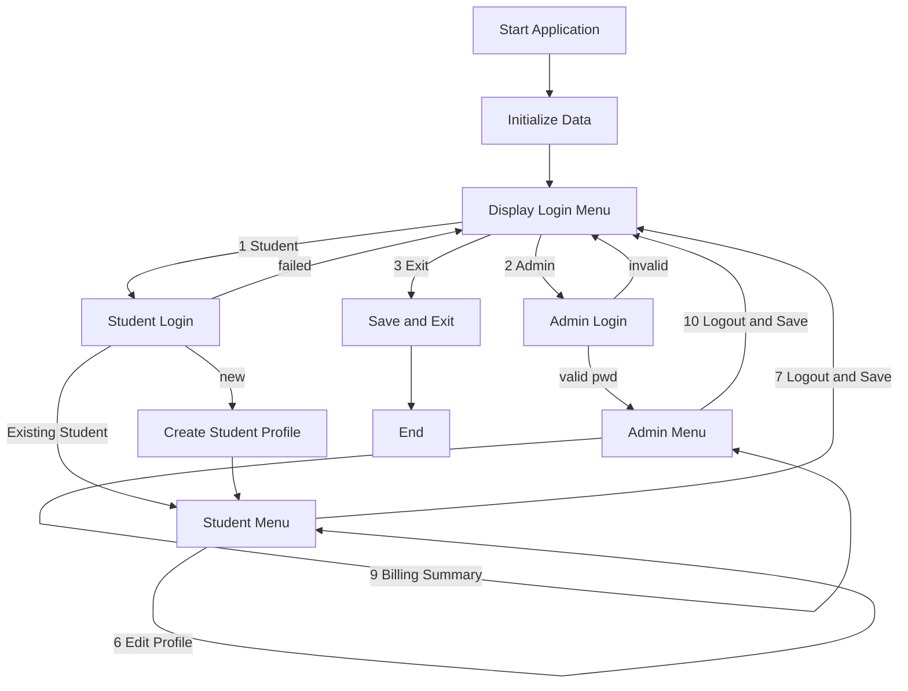

# unknownapp
This is an unknown application written in Java

---- For Submission (you must fill in the information below) ----
### Use Case Diagram

```mermaid
usecaseDiagram
    actor Student
    actor Admin
    Student --> (Login)
    Admin --> (Login)
    Student --> (Create Profile)
    Student --> (View Course Catalog)
    Student --> (Register for Course)
    Student --> (Drop Course)
    Student --> (View My Schedule)
    Student --> (Billing Summary)
    Student --> (Edit My Profile)
    Student --> (Logout)
    Admin --> (View Course Catalog)
    Admin --> (View Class Roster)
    Admin --> (View All Students)
    Admin --> (Add New Student)
    Admin --> (Edit Student Profile)
    Admin --> (Add New Course)
    Admin --> (Edit Course)
    Admin --> (View Student Schedule)
    Admin --> (Billing Summary for Student)
    Admin --> (Logout)

    (Login) .> (Create Profile) : optional
    (Logout) .> (Save Data) : includes
```

### Flowchart of the main workflow



### Prompts
